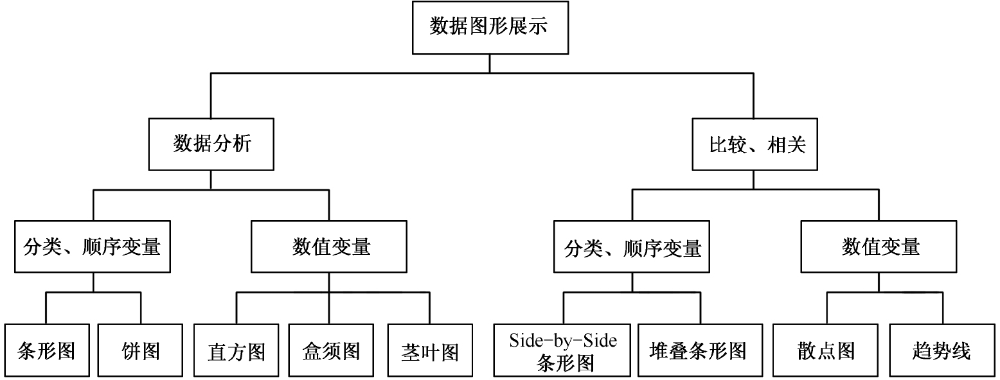

## 统计分析算法

### 描述性统计

 

### 推断统计

推断统计以概率论为基础，根据抽样样本对总体的分布进行参数估计和假设检验。

#### 概率分布

#### 参数估计

#### 假设检验

## 机器学习算法

### 回归

建立连续或离散自变量（输入变量）与连续因变量（输出变量）之间的关系，与函数拟合问题等价。

常用的评价指标包括 MSE（Mean Square Error）、R2（Multiple Coefficient of Determination）。

#### 线性回归

可解释性强，计算速度快。OLS（Ordinary Least Square）假设自变量与因变量之间存在线性关系，各自变量非线性相关。如果自变量高度相关会带来多重共线性问题，导致建模结果难以解释、回归系数不稳定。解决高度相关问题的常用方法有计算相关系数并设定阈值进行过滤、VIF（Variance Inflation Factors）、Ridge回归、Lasso回归。

#### 非线性回归

对模型进行线性基展开，可以使线性模型适用于非线性回归，基函数类型可以是多项式（泰勒展开）、分段样条平滑、三角多项式（傅里叶展开）、Wavelet展开等，这种非线性模型属于参数模型。核平滑模型属于非参数模型，它用基函数对输入样本点附近的样本子集进行拟合，典型的方法有LOESS（Locally Estimated Scatterplot Smoothing）、RBF（Radial Basis Functions）等。

CART（Classification and Regression Trees）可以用来做回归，又可以用来做分类。

NN（Neural Network）常见的回归 NN 模型有 MLP（Multilayer Perceptron）和 RNN（Recurrent Neural Network）。

### 分类

用于建立连续或离散自变量与取值有限的离散因变量之间的关系。常见的工业应用场景有故障检测、故障诊断。

常用的分类模型评价指标有准确率、精确率、召回率、F1值等。多分类评价指标 Macro F1 和 Micro F1。

